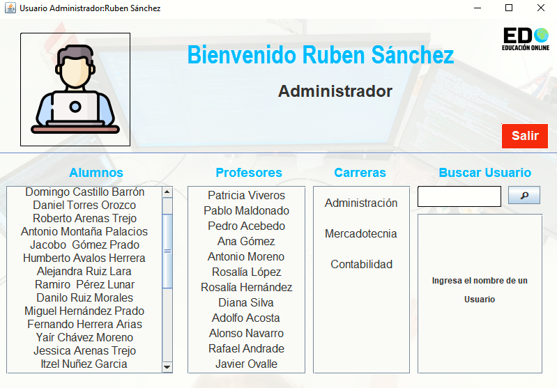

# ADMINISTRADOR DE MATRICULA ESCOLAR - EDO

---

EDO (Educational Desktop Organizer) es una aplicación de escritorio desarrollada en Java que se basa en los principios de la Programación Orientada a Objetos (POO). Esta aplicación tiene como objetivo principal gestionar y asignar docentes y estudiantes en un entorno educativo. Sus principales características incluyen:

**Gestión de Docentes:**

- EDO permite llevar un registro detallado de los docentes, incluyendo información como la carrera a la que están asignados, las materias que imparten, sus colegas docentes en la misma carrera, los grupos que tienen asignados y la lista de todos los alumnos que están bajo su supervisión.

**Gestión de Alumnos:**

- La aplicación también gestiona información relacionada con los alumnos, como la carrera en la que están matriculados, los docentes que les impartirán clases, el grupo al que pertenecen y sus compañeros de clase.

**Funcionalidad del Administrador:**

- El administrador de EDO tiene privilegios especiales y puede acceder a una visión global del sistema. Esto incluye la capacidad de visualizar y consultar todos los alumnos y profesores registrados en el sistema. Además, el administrador cuenta con una funcionalidad de búsqueda que le permite ingresar un nombre de usuario y recuperar toda la información asociada a dicho usuario.

EDO es una aplicación de escritorio desarrollada en Java que se basa en la Programación Orientada a Objetos (POO) y se centra en la gestión de docentes y alumnos en un entorno educativo. Proporciona una plataforma eficiente para asignar docentes a cursos y supervisar la información clave de los estudiantes, todo ello con la capacidad adicional de búsqueda y recuperación de datos por parte del administrador del sistema.

---

## Capturas

